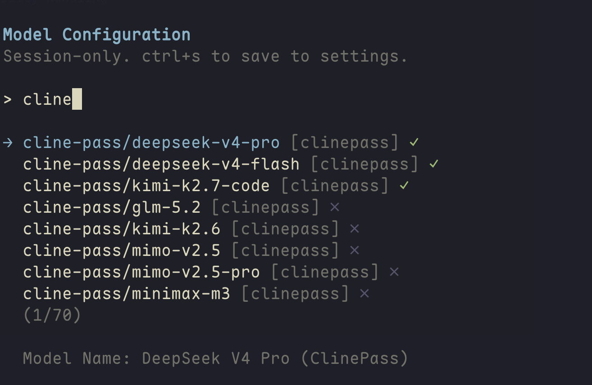

# pi-clinepass-provider 🚀

[](https://www.npmjs.com/package/pi-clinepass-provider)
[](https://www.npmjs.com/package/pi-clinepass-provider)
[](LICENSE)
[](https://github.com/jellydn/pi-clinepass-provider/actions)

> ClinePass provider for [pi](https://github.com/earendil-works/pi) — 11 curated open-weight coding models (GLM-5.2, Kimi K2.7 Code, Kimi K3, DeepSeek V4, Qwen3.7, and more) through Cline's $9.99/month subscription with 2-5x standard API rate limits.

ClinePass uses Cline's **OpenAI-compatible Chat Completions API**, so no custom streaming protocol is needed — pi's built-in `openai-completions` streaming handles SSE parsing, tool calls, and usage tracking.

[](https://gyazo.com/f157bb2431d7c77556d5748c8b58c7a9)

## 📦 Installation

### As a pi extension (recommended)

```sh
pi install npm:pi-clinepass-provider
# or from git
pi install git:github.com/jellydn/pi-clinepass-provider
# or local path
pi install /path/to/pi-clinepass-provider
```

### As an npm package

```sh
npm install pi-clinepass-provider
# or
pnpm add pi-clinepass-provider
```

> **Note:** This package requires `@earendil-works/pi-ai` and `@earendil-works/pi-coding-agent` as peer dependencies. They are automatically available when installed as a pi extension; install them manually when using as a standalone npm dependency.

## Pre-requirements

- [pi](https://github.com/earendil-works/pi) coding agent
- A [ClinePass](https://docs.cline.bot/getting-started/clinepass) subscription — $9.99/month

## Features

- **Full streaming** via Cline's OpenAI-compatible `/api/v1/chat/completions` endpoint — SSE parsing, tool calls, and usage tracking handled by pi's built-in `openai-completions` streaming
- **Per-model thinking level support** — maps pi's 6 thinking levels (`off` / `minimal` / `low` / `medium` / `high` / `xhigh`) to provider-specific `reasoning_effort` values, with per-model capability matrices (see table below)
- **Per-token cost tracking** against ClinePass reference pricing
- **WorkOS OAuth token refresh** — reuses your existing Cline CLI login (`cline auth`); no separate API key needed
- **API key auto-discovery** from `CLINE_API_KEY` env var, `~/.cline/data/settings/providers.json`, or `~/.pi/agent/auth.json`
- **Dynamic model discovery** — fetches the live model list from the Cline API at startup, falling back to a curated static list on error
- **`/login` integration** — automatic WorkOS OAuth detection or browser-assisted manual paste
- **Modular architecture** — 8 focused source modules (`env`, `auth`, `models`, `workos`, `oauth`, `error-handler`, `errors`, `utils`) + entry point (`index`), all covered by per-module unit tests

## Supported Models



| Model             | Model ID                       | Context | Reasoning                         |
| :---------------- | :----------------------------- | :------ | :-------------------------------- |
| GLM-5.2           | `cline-pass/glm-5.2`           | 200K    | off / low / medium / high / xhigh |
| Kimi K2.7 Code    | `cline-pass/kimi-k2.7-code`    | 262K    | low / medium / high               |
| Kimi K2.6         | `cline-pass/kimi-k2.6`         | 262K    | low / medium / high               |
| Kimi K3           | `cline-pass/kimi-k3`           | 1M      | high (max; always on)              |
| DeepSeek V4 Pro   | `cline-pass/deepseek-v4-pro`   | 1M      | off + high (high used for xhigh)  |
| DeepSeek V4 Flash | `cline-pass/deepseek-v4-flash` | 1M      | off + high (high used for xhigh)  |
| MiMo-V2.5         | `cline-pass/mimo-v2.5`         | 262K    | off / low / medium / high         |
| MiMo-V2.5-Pro     | `cline-pass/mimo-v2.5-pro`     | 262K    | off / low / medium / high         |
| MiniMax M3        | `cline-pass/minimax-m3`        | 1M      | off / low / medium / high         |
| Qwen3.7 Max       | `cline-pass/qwen3.7-max`       | 262K    | off / low / medium / high         |
| Qwen3.7 Plus      | `cline-pass/qwen3.7-plus`      | 1M      | off / low / medium / high         |

> **Thinking levels**: pi supports 6 levels — `off`, `minimal`, `low`, `medium`, `high`, `xhigh`. Each model declares which levels it supports, mapped to the provider's `reasoning_effort` parameter. Set the thinking level with pi's `--thinking` flag or `/thinking` command. A level marked as unsupported (not listed above) maps to `null` — no `reasoning_effort` is sent to the API, so the model runs with its default reasoning behavior.

## Authentication

This extension supports **two authentication methods**, tried in order:

### Option 1: Cline CLI Login (WorkOS OAuth — recommended)

If you already use the [Cline CLI](https://docs.cline.bot) (`npm i -g cline`) and have authenticated with `cline auth`, this extension **automatically reuses your login** — no separate API key needed.

Run `pi /login` and select **ClinePass**. The extension detects your WorkOS OAuth credentials from `~/.cline/data/settings/providers.json` and logs you in instantly. Short-lived access tokens (~1 hour) are refreshed automatically via Cline's server-side endpoint.

### Option 2: Static API Key (manual)

1. Subscribe to ClinePass at [app.cline.bot](https://app.cline.bot), go to **Settings → API Keys** and click **Generate API key**. Copy it.
2. Set the environment variable:

```sh
echo 'export CLINE_API_KEY="your_key_here"' >> ~/.zshrc
source ~/.zshrc
```

Alternatively, run `pi /login` and select **ClinePass** — if no Cline CLI login is detected, it opens the Cline dashboard and prompts you to paste a static API key.

<details>
<summary>💡 How does WorkOS OAuth token refresh work?</summary>

The Cline CLI authenticates via WorkOS OAuth (browser login). The access token is a short-lived JWT (prefixed with `workos:`) that expires after ~1 hour. The refresh token is longer-lived.

This extension refreshes expired tokens by calling Cline's server-side endpoint:

```
POST https://api.cline.bot/api/v1/auth/refresh
{"granttype": "refresh_token", "refreshToken": "<your_refresh_token>"}
```

The response contains a new `accessToken` (with `workos:` prefix) and a rotated `refreshToken`. Both are persisted in pi's auth store for subsequent requests.

If the refresh token expires or is revoked (e.g., you re-login with `cline auth`), simply run `pi /login` again to re-import your fresh credentials.

</details>

## Usage

```sh
# Non-interactive
pi --model clinepass/cline-pass/deepseek-v4-flash -p "Explain async/await in JavaScript"

# Interactive
pi --model clinepass/cline-pass/kimi-k2.7-code

# List available models
pi --list-models clinepass

# Use in another project
cd my-project
pi --model clinepass/cline-pass/glm-5.2 --trust "Refactor the auth module"
```

Switch models in-session with `/model clinepass/cline-pass/glm-5.2`.

### Thinking levels

Set the reasoning effort per model using pi's `--thinking` flag or the in-session `/thinking` command:

```sh
# Use high reasoning with DeepSeek V4 Pro
pi --model clinepass/cline-pass/deepseek-v4-pro --thinking high -p "Design a scalable microservice architecture"

# GLM-5.2 supports five levels up to xhigh
pi --model clinepass/cline-pass/glm-5.2 --thinking xhigh -p "Solve this complex math proof"

# Disable reasoning for a quick code gen task
pi --model clinepass/cline-pass/deepseek-v4-flash --thinking off -p "Write a React form component"
```

Each model's supported thinking levels are listed in the [Supported Models](#supported-models) table above. Unsupported levels are not sent to the API — the model runs with its default reasoning behavior.

## Run tests

```sh
npm test
```

## Pre-commit

This project uses [prek](https://github.com/earendil-works/prek) to enforce code quality. To install hooks:

```sh
prek install
```

## Notes

- **Pricing**: ClinePass is a flat $9.99/month subscription. Per-token costs in the model table are reference values for usage tracking only.
- **Context windows**: estimates from ClinePass docs — verify against Cline's `/models` endpoint.
- **Custom API base**: set `CLINE_API_BASE` env var to override the endpoint (default: `https://api.cline.bot`).

## Resources

- **[opencode-clinepass-provider](https://github.com/haconglinh1990/opencode-clinepass-provider)** — ClinePass provider for [OpenCode](https://github.com/sst/opencode); same subscription and models outside of pi.

## 📄 License

This project is licensed under the **MIT License** - see the [LICENSE](LICENSE) file for details.

## 📋 Changelog

See [CHANGELOG.md](CHANGELOG.md) for release history.

## Author

👤 **Huynh Duc Dung**

- Website: https://productsway.com/
- Twitter: [@jellydn](https://twitter.com/jellydn)
- Github: [@jellydn](https://github.com/jellydn)

## Show your support

Give a ⭐️ if this project helped you!

<a href="https://ko-fi.com/dunghd">
  
</a>
<a href="https://paypal.me/dunghd">
  
</a>
<a href="https://www.buymeacoffee.com/dunghd">
  
</a>
